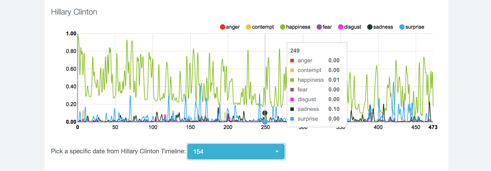
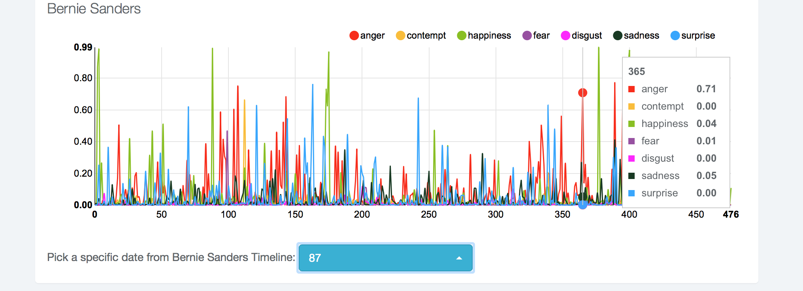

# Debate in Emotion

This project is the result of the #devfest16 hackathon at Columbia University, which took place on February 5th, 2016. 

The goal of this project is to analyse the variation in presidential candidates' emotions during debates. For that matter, we took as a sample the debate between Hillary Clinton and Bernie Sanders, which took place on February 4th, 2016. 

Samples were taken from the following video 

## Sample screenshots

The graph below shows the emotion levels of both candidates over time, during the two-hour long presidential debate on February 4th. Emotions range from anger to happiness. 

Hovering over specific points show the estimated emotion levels on a video capture at a specific time. Additionally, emotions can be turned off and on in order to clarify the plots. 

## Usage

Just open *app/index.html* in a browser. Safari and Firefox are recommended. There are known issues with Google Chrome, which we hope to fix soon. 

## APIs

This project relies heavily on the following APIs: 

* Microsoft® Project Oxford Video API
* Microsoft® Project Oxford Emotion API
* Alchemy® Entity Extraction API

## Technologies

* All data processing was done in **Python 3** with **MongoDB** as the database, connecting through **pyMongo**. 
* Text and grep-hacking was done using **Sublime Text 3** and **Atom**. 
* The front-end has been implemented using **jQuery**, **d3.js** and **nvd3**.
* The video file was split sequentially using **Matlab**. 

## The Team

We're MS in Data Science students at Columbia University. We go by the following names:

* Carlos Espino *(Mexico)*
* Amirhos Imani *(Iran)*
* Xavier González *(Argentina)*
* Diego Llarrull *(Argentina)*

